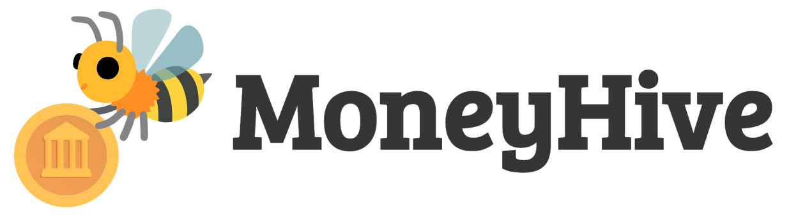

# MoneyHive

 

## <a name="table">Table of Contents</a>

1. 📝 [Introduction](#introduction)
2. 🛠️ [Tech Stack](#tech-stack)
3. 🔮 [Features](#features)
4. 🚫 [Limitations](#limitations)
5. 🚀 [Quick Start](#quick-start)
6. 🧪 [Testing the Application](#testing-the-application)

## <a name="introduction">📝 Introduction</a>

MoneyHive is a financial SaaS platform built with **Next.js** and **TypeScript**. It allows users to manage their finances by securely connecting to multiple bank accounts, viewing real-time transactions, and transferring funds to other platform users.

This project was inspired by a [JavaScript Mastery tutorial on YouTube](https://www.youtube.com/watch?v=PuOVqP_cjkE&t=11024s&ab_channel=JavaScriptMastery). You can also find the original code on their [GitHub repository](https://github.com/adrianhajdin/banking/tree/main).

However, I have made several customisations of my own to this project, including additional components, updated styling, and new features to give it a unique flair and improve its functionality.

## <a name="tech-stack">🛠️ Tech Stack</a>

- **Next.js** – React framework for server-side rendering
- **TypeScript** – A statically typed superset of JavaScript
- **Appwrite** – Backend-as-a-service for handling user authentication and data storage
- **Plaid** – A powerful API for connecting bank accounts and retrieving transaction data
- **Dwolla** – Secure money transfer API for facilitating user-to-user fund transfers
- **React Hook Form** – Library for handling form validation and submission
- **Zod** – Type-safe schema validation for input validation
- **TailwindCSS** – Utility-first CSS framework for fast UI development
- **Chart.js** – JavaScript library for visualizing data (used for financial graphs and insights)
- **ShadCN** – Component library for building fast and responsive UI components

## <a name="features">🔮 Features</a>

### Authentication
- Secure SSR-based authentication with robust validation and authorization processes to ensure user safety.

### Bank Account Integration
- Seamlessly link multiple bank accounts using **Plaid** for real-time transaction data and balance updates.

### Home Page
- A comprehensive user dashboard displaying an overview of financial data, including:
    - Total balance from all connected accounts
    - Recent transactions
    - Spending breakdown by category

### Bank Account Management
- View a detailed list of all connected bank accounts, complete with balances and account details.

### Transaction History
- Easily view and filter past transactions across different bank accounts with support for pagination.

### Real-time Updates
- Instant updates across the platform whenever a new bank account is connected or transactions occur.

### Fund Transfers
- Effortlessly transfer funds between users via **Dwolla**, with necessary recipient details and secure processing.

### Responsive Design
- Fully responsive design ensuring a seamless experience on desktop, tablet, and mobile devices.

## <a name="limitations">🚫 Limitations</a>

### Geographical Limitation
Currently, this app is best suited for **USA-based users**. The **Plaid** integration used to connect bank accounts only supports U.S. financial institutions. Unfortunately, Plaid does not yet support connections to New Zealand (NZ) banks or other international institutions.

### Sandbox Environment
Due to the limitations with Plaid's geographical reach, this app operates in a **sandbox environment** for now. This means that while users can explore the functionality, actual bank connections and live transactions cannot be made outside of the supported regions (currently the USA).


## <a name="quick-start">🚀 Quick Start</a>

To get the project up and running locally on your machine, follow the steps below:

**Prerequisites**

Make sure the following dependencies are installed on your system:

- [Git](https://git-scm.com/)
- [Node.js](https://nodejs.org/en)
- [npm](https://www.npmjs.com/) (Node Package Manager)

**Cloning the Repository**

Clone the repository and navigate into the project directory:

```bash
git clone https://github.com/rosie-roses/money-hive-app.git
cd money-hive-app
```

**Installation**

Install the required project dependencies:

```bash
npm install
```

**Set Up Environment Variables**

Create a ```.env``` or ```.env.local``` file in the root directory using the ```.env.example``` file as a template.

Populate the file with your respective account credentials. These credentials can be obtained by signing up for the following services:
- [Appwrite](https://appwrite.io/)
- [Plaid](https://plaid.com/)
- [Dwolla](https://www.dwolla.com/)

**Running the Project**

Start the development server:

```bash
npm run dev
```

Once the server is up and running, open your browser and go to [http://localhost:3000](http://localhost:3000) to see the application in action.

## <a name="testing-application">🧪 Testing the Application</a>

If you'd like to test the application, here’s what you need to know:

### Sign-Up Process
- During sign-up, make sure to provide a **valid U.S. state** in your profile. If a U.S. state is not selected, the connection to Dwolla will break.

### Bank Account Integration (Plaid Sandbox)
- When connecting your bank account, you can continue as a guest.
- Select an institution and when prompted for sign-in credentials, use **Plaid's sandbox credentials**:
    - **Username**: ```user_good```
    - **Password**: ```pass_good```
- You do not need to provide a mobile number or code. Simply click **"Get code"** and **"Submit"**.
- After signing in, select a bank account to connect, check all the checkboxes, and you should be able to complete the connection.

### Test User
If you want to skip the sign-up process and quickly explore the app, you are welcome to use the test user credentials:
- **Email**: ```alice@wonderland.com```
- **Password**: ```12345678```

This will allow you to access the app without having to sign up.